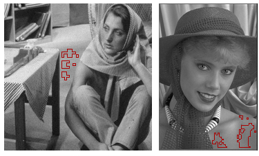
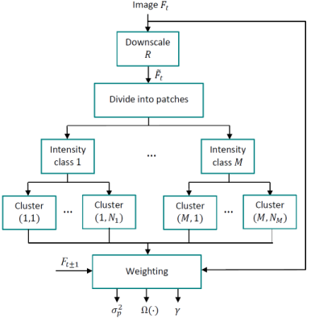

# IVHC (Fast image noise estimation)

This is an implementation of [IVHC](https://ieeexplore.ieee.org/document/7506318) on Python and Matlab.
See also [IVHC](https://users.encs.concordia.ca/~amer/NEstIVHC/).
IVHC is a model to estimate Gaussian, signal-dependent, and processed noise in image and video signals.
The estimation is based on the classification of intensity-variances 
of image patches in order to find homogeneous regions that best represent the noise. 

Here is the block diagram of the intensity-variance
homogeneity classification (IVHC) noise estimation.

**Inputs**:
* Noisy gray image
* Max polynomial regression degree

**Outputs**:
* Variance of noise in the Y channel (best representative)
* Degree of processed noise 
* Noise level function

The repository includes:
* Matlab and Python implementation of IVHC.
* Matlab demo files to estimate AWGN, processed noise, and signal-dependent noise.
* Python demo files to estimate AWGN, processed noise, and signal-dependent noise.
 
## Python

#### Getting Started

* [demo.ipynb](Python/demo.ipynb) or (demo.py) is the easiest way 
 to start. It shows an example of estimating three types of noise. AWGN, PPN, and PGN.

Python Installation
1. Install dependencies
	pip3 install package [numpy, skimage, ...]
2. Run setup from the libs directory
python3 setup.py install
optional:
	run "python3 setup.py build" and copy .so (linux) or .pyd (windows) file to the demos.py path
	or if you have python3.6 copy "ivhc.cpython-36m-x86_64-linux-gnu.so" (linux) or "ivhc.cp36-win_amd64.pyd" (windows) to your demos.py path.

3. Run demos.py:
*python3 demos.py*

## Matlab (windows only)

* [demo_awgn.m](Matlab/demo_awgn.m) is the easiest way 
to start. It shows an example of estimating AWGN.

* [demo_pgn.m](Matlab/demo_pgn.m) PGN (signal-dependent) noise estimation.

* [demo_ppn.m](Matlab/demo_ppn.m) PPN processed noise estimation.

* [demo_real.m](Matlab/demo_real.m) non-synthetic (real) image noise.

* [demo_compare_awgn.m](Matlab/demo_compare_awgn.m) compare AWGN with other method.

* [demo_compare_ppn.m](Matlab/demo_compare_ppn.m) compare PPN with other method.

 